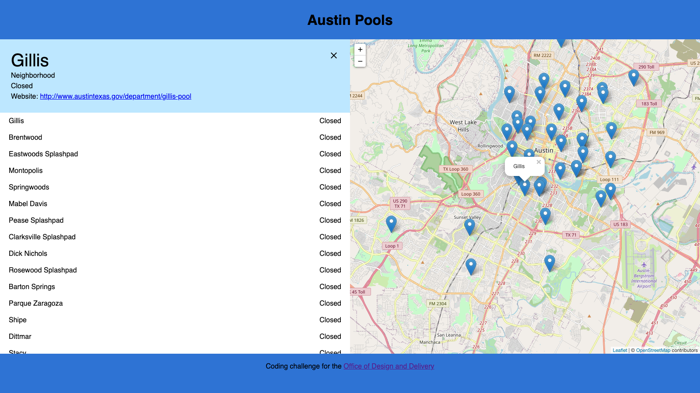
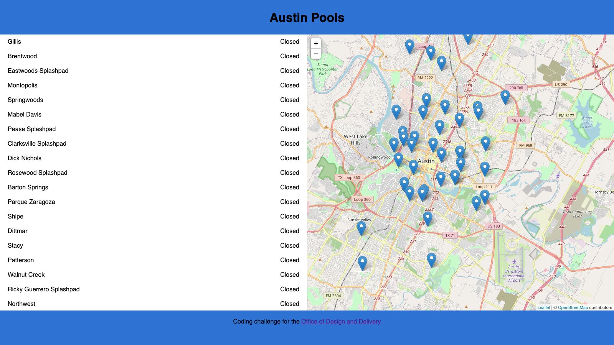

# Frontend Challenge

### Challenge

Your task is to create a webpage that showcases all of the public pools in Austin. This data comes from our Open Data Portal: https://data.austintexas.gov/Recreation-and-Culture/Austin-Pool-Schedule/xaxa-886r

### To get started:

- Install dependencies: `yarn`
- Run a local server: `yarn start`

### Instructions

When you first load up the coding challenge, it will contain boilerplate code that you need to finish. Here's what the finished product will look like:



---

1. Create a list of pools on the lefthand Sidebar. Display the "name" of the pool on the right side of the row, and the "status" on the left side. When the cursor hovers over a row, make the cursor a "pointer" and give the row the color #00adff30.
2. Place map markers for each pool.



---

3. Allow a user to select a pool from the list. When a pool is selected:
   - Render a SelectedPoolTile above the PoolList.
   - Center the Map over the selectedPool.
   - Render a Popup on the map with the pool's name.


---

4. Allow users to also select a pool by clicking a map marker.


---

5. The list of pools should overflow-scroll within the sidebar.


---

6. Add the CloseIcon to the top right side of the SelectedPoolTile. When its clicked, the pool is de-selected and the map marker popup closes.


---

7. When the map marker popup for a pool is closed, then also close the SelectedPoolTile.


### Hints & Guidelines

- You must work on this alone. Do not share the code challenge with others.
- Write clean code.
- Reorganize/rewrite any components or css as needed in order to complete the design requirements.
- The boilerplate uses React Hooks. They are fairly new, so if you're unfamiliar with them you're welcome to use classic lifecycle methods instead (render, componentWillMount, etc). That being said, React Hooks doesn't take long to pick up and it makes a lot of that data lifecycle management easier. So it might be worthwhile to give it a try. :)
- Programmatically opening and closing the MapMarker Popups is the trickiest part of the challenge. I recommend trying the useRef() hook in order to access the openPopup and closePopup methods on the marker.
  - useRef docs: https://reactjs.org/docs/hooks-reference.html#useref
  - Leaflet docs: https://leafletjs.com/reference-1.7.1.html
- Leaflet is a tiny bit glitchy, about 1/20 times it may not always center correctly on the right spot on the map. That's not on you to fix.
- Don't spend more than an hour or two on the challenge.

### Resources

- Endpoint to data: https://data.austintexas.gov/Recreation-and-Culture/Austin-Pool-Schedule/xaxa-886r
- React Hooks: https://reactjs.org/docs/hooks-intro.html
- React leaflet: https://react-leaflet.js.org/docs/en/examples
- Leaflet: https://leafletjs.com/reference-1.7.1.html
- Us. If you are stuck, or need guidance, leave a comment to a line of code in Github or email us.


### Bonus

If you attempt this part, don't spend longer on it than you think is necessary. There are many edge cases that can arise from this feature! You're not expected to untangle all of them. Go as far or short as you'd like, this is just for fun.

Here's your bonus challenge: when you select a pool from the lefthand list, can you automatically zoom to that pool's location on the map and open its popup?

To run methods directly on a Leaflet marker component, you'll have to utilize the useRef() hook. Your logic might look something like this:
```
const poolMarkerRef = useRef()
useEffect((...) => {
  if (...) {
    poolMarkerRef.leafletElement.openPopup()
  }
}, [...])
```
---

This project was bootstrapped with [Create React App](https://github.com/facebookincubator/create-react-app).
